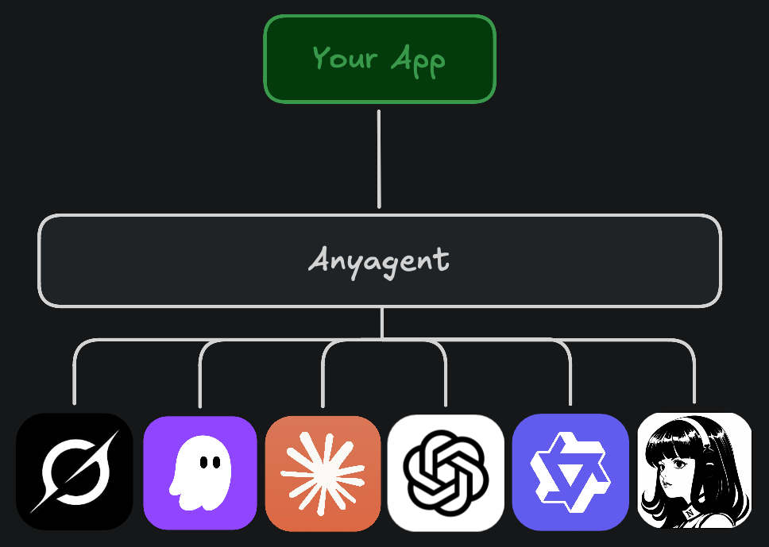

# anyagent

[](https://github.com/spotta85/anyagent/actions/workflows/ci.yml)
[](https://crates.io/crates/anyagent)
[](https://docs.rs/anyagent)
[](#license)

One Rust interface to the coding agents installed on a machine.

Users have Claude Code, Codex, Grok, OpenCode, Kiro, and friends on their
machines — each with its own CLI, protocol, and quirks. If you're building an
app on top of them, you end up writing and maintaining a driver per agent.
anyagent is that layer, once: it finds the agents, speaks each one's protocol
(native or [ACP](https://agentclientprotocol.com)), and gives you one typed
API — `Runtime`, `Session`, and a stream of `Events`.



Your app keeps its own transcript, UI, and policy. anyagent owns the
processes, the wires, and the turn rules — every agent behaves the same way
through it.

## Use

```toml
[dependencies]
anyagent = "0.1"
```

```rust
use anyagent::{EventKind, Runtime, SessionOptions};
use futures::StreamExt;

let runtime = Runtime::new();
let agent = runtime.discover().await.require("claude")?;
let (session, mut events) = runtime.open(&agent, SessionOptions::in_dir(".")).await?;

session.prompt("explain this repo").await?;
while let Some(event) = events.next().await {
    match event?.kind {
        EventKind::TextDelta { text, .. } => print!("{text}"),
        EventKind::TurnEnded { .. } => break,
        _ => {}
    }
}
session.close().await?;
```

That's the whole core flow. Everything else is the same few objects:

## Features

| Area | Capability | API |
|---|---|---|
| Discovery & auth | Discover installed agents and check login status | `runtime.discover()`, `runtime.probe(agent)` |
| Discovery & auth | Drive a login flow (URL out, status back) | `runtime.login(agent, method)` |
| Discovery & auth | Plan quota for the logged-in account | `runtime.plan_usage(agent)` |
| Session control | Send text, images, slash commands | `session.prompt(input)` |
| Session control | Steer or interrupt a running turn | `session.prompt(..)` mid-turn, `session.cancel()` |
| Session control | Answer a permission or question the agent raised | `session.answer(id, answer)` |
| Session control | Switch model / mode / any advertised option live | `session.configure("model", "sonnet")` |
| Conversation management | Resume, fork, or rewind a conversation | `SessionOptions::resume` / `fork_from`, `session.rollback(..)` |
| Conversation management | Hand the agent your MCP servers | `SessionOptions::mcp_server(..)` |

Events cover streamed text and reasoning, typed tool calls with diffs, plans,
token usage, permission requests, subagents, and turn boundaries — the same
`EventKind`s for every agent. Anything provider-specific rides in
`extensions` instead of leaking into the types.

## Supported agents

| Agent | Wire |
|---|---|
| Claude Code | native (stream-json) |
| Codex | native (app-server) |
| Grok, Hermes, OpenCode, Kiro CLI, Qwen Code | ACP |

Any other ACP agent works without a catalog entry via
`AgentInstallation::acp(name, path, args)`.

## License

MIT or Apache-2.0.
